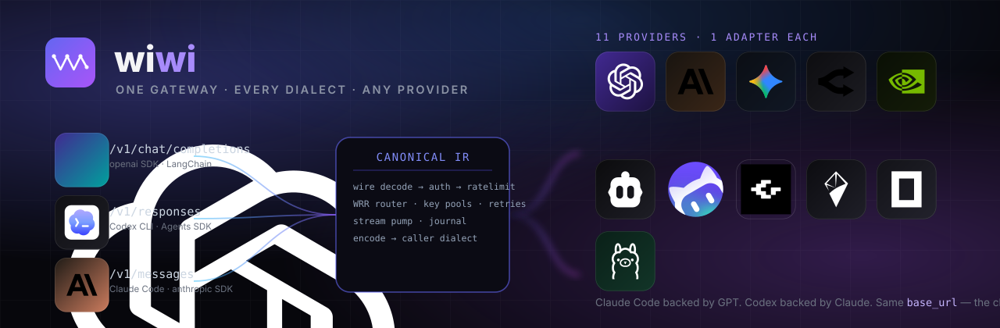

<div align="center">



# 🌀 wiwi

### One gateway. Every dialect. Any provider.

**Speak** OpenAI Chat · OpenAI Responses (Codex CLI) · Anthropic Messages (Claude Code) **on the inbound.**<br/>
**Route to** OpenAI · Anthropic · Gemini · OpenRouter · NVIDIA NIM · Cline · WorkBuddy · GMI Cloud · B.AI · OpenCode Zen · any OpenAI-compatible endpoint.

<p>
  <a href="LICENSE"></a>
  <a href="#-quickstart"></a>
  <a href="#-quickstart"></a>
  <a href="#-quickstart"></a>
  <a href="#-quickstart"></a>
</p>

<p>
  
  
  
  
</p>

**3 inbound dialects × 11 outbound providers — no pairwise converters, one canonical IR.**

</div>

---

## 🪄 The trick

**Point Claude Code at GPT.** Not a compatibility shim — a real translation layer.

```bash
# An Anthropic-dialect request...
curl http://localhost:4000/v1/messages \
  -H "x-api-key: $WIWI_VIRTUAL_KEY" -H "anthropic-version: 2023-06-01" \
  -H "content-type: application/json" \
  -d '{"model":"gpt-4o","max_tokens":128,
       "messages":[{"role":"user","content":"hi"}]}'
```

...comes back in the **Anthropic dialect** — `content` blocks, `stop_reason`, `usage.input_tokens` — even though a
non-Anthropic model served it. The client never learns. Same in reverse: send OpenAI Chat to a Claude model and
the envelope is OpenAI's.

That works because nothing is written pairwise. Every direction goes **dialect → IR → provider**:

```
Client (openai SDK / Codex CLI / Claude Code)
   │  inbound dialect
   ▼
wiwi/wire/*  ──decode──►  Canonical IR (wiwi/ir)  ──►  router
                                                        │  key pools, WRR,
                                                        │  retries, cooldowns
                                                        ▼
                                                  providers/*  ──► upstream
Client  ◄──  wire encoder  ◄──  IRStreamDelta*  ◄──  adapter.decode
```

Adding an inbound surface is one module in `wiwi/wire/`. Adding a provider is one adapter in `wiwi/providers/`.
**Core code never branches on dialect or provider name.**

---

## ✨ Why wiwi?

> **LiteLLM gives you routing. wiwi gives you routing + a live control plane.**

| 😩 Problem | 💡 wiwi's answer |
|---|---|
| One client dialect, many models behind it | **Hub-and-spoke translation.** Any of 3 inbound dialects ↔ any of 11 outbound providers. N×M coverage from N+M modules. |
| Rate-limit pain across many keys | **Smooth weighted round-robin** key pools, per-key cooldowns, `failover_mode`, retries. |
| Reasoning params don't line up | IR collapses `reasoning_effort`, `thinking.budget_tokens`, OpenRouter's `reasoning{}` into one form. Multi-turn survives a mid-conversation model switch. |
| Want a UI, not just YAML | Built-in dark console at `/console` — keys, providers, pools, live SSE logs, per-request TTFT/TPS/cost. |
| Mutating config means a restart | Live `/admin/*` mutations persist to DB **and** write an audit event. No dropped traffic. |
| Costs and budgets | Virtual keys with budget / RPM / TPM / model allowlist / TTL + aggregate & timeseries rollups. |
| No idea what's happening *now* | `/admin/stream` SSE live tail with `Last-Event-ID` replay, plus opt-in Prometheus `/metrics`. |

---

## ⚡ Quickstart

### 📋 Requirements

<p>
  
  
  
  
</p>

### 🚀 Install & run

```bash
# 1. config
cp wiwi.yaml.example wiwi.yaml        # then edit providers/keys/model_list

# 2. provider keys + admin key  (or put these in .env — see .env.example)
export OPENAI_API_KEY=sk-... \
       ANTHROPIC_API_KEY=sk-ant-... \
       WIWI_MASTER_KEY=sk-wiwi-master-mysecret

# 3. install & run
uv venv && uv pip install -e ".[dev]"
wiwi --config wiwi.yaml               # serves http://0.0.0.0:4000
```

Open **<http://localhost:4000/login>** and sign in with the master key — the console lives at `/console`.

### 🔑 Mint a key for your client

Clients authenticate with a **virtual key**, not the master key. Mint one from the console
(**Virtual Keys → New key**) or from the API — plaintext is shown exactly once:

```bash
export WIWI_VIRTUAL_KEY=$(curl -s -X POST localhost:4000/admin/keys/generate \
  -H "Authorization: Bearer $WIWI_MASTER_KEY" \
  -d '{"name":"my-client","max_budget":10}' | python3 -c 'import json,sys;print(json.load(sys.stdin)["key"])')
echo "$WIWI_VIRTUAL_KEY"   # sk-wiwi-… — store it now, it is not retrievable later
```

The examples below all use `$WIWI_VIRTUAL_KEY`.

### 🐳 Or run with Docker

```bash
export WIWI_MASTER_KEY=sk-wiwi-master-mysecret
docker compose up --build
```

Postgres 16 + Redis + wiwi together, a `wiwi_data` volume, `DATABASE_URL` defaulted to the bundled Postgres.
Override with `DATABASE_URL=sqlite+aiosqlite:///…` to stay on SQLite. Three-stage build: `uv` installs Python
deps → `npm` builds the SPA → the runtime image runs as non-root `wiwi` (uid 10001).

### 🔌 Connect a client

| Client | Set this | Then run |
|---|---|---|
| 🤖 **Claude Code** | `ANTHROPIC_BASE_URL=http://localhost:4000`<br>`ANTHROPIC_AUTH_TOKEN=sk-wiwi-…` | `claude` |
| ⌨️ **Codex CLI** | `OPENAI_BASE_URL=http://localhost:4000/v1` | `codex --model gpt-4o` |
| 🐍 **openai SDK** | `base_url="http://localhost:4000/v1"`<br>`api_key="sk-wiwi-…"` | `client.chat.completions.create(...)` |
| 🌐 **curl** | `Authorization: Bearer sk-wiwi-…` | `curl localhost:4000/v1/models` |

<details>
<summary><b>Full snippets</b></summary>

```bash
# Claude Code
export ANTHROPIC_BASE_URL=http://localhost:4000
export ANTHROPIC_AUTH_TOKEN=sk-wiwi-...
claude

# Codex CLI
export OPENAI_BASE_URL=http://localhost:4000/v1
codex --model gpt-4o

# openai SDK
python3 -c '
from openai import OpenAI
client = OpenAI(base_url="http://localhost:4000/v1", api_key="sk-wiwi-...")
print(client.chat.completions.create(model="gpt-4o", messages=[{"role":"user","content":"hi"}]).choices[0].message.content)'

# curl — Anthropic dialect in, OpenAI model behind it
curl http://localhost:4000/v1/messages \
  -H "x-api-key: $WIWI_VIRTUAL_KEY" -H "anthropic-version: 2023-06-01" \
  -H "content-type: application/json" \
  -d '{"model":"gpt-4o","max_tokens":128,
       "messages":[{"role":"user","content":"hi"}]}'
```
</details>

---

## 🎛️ The control plane


Four things wiwi does that a config-file gateway doesn't.

### 🔁 Translation, both directions

- **3 inbound dialects × 11 outbound providers**, with `drop_params` and `extra_headers` for the awkward edges.
- **Builtin tool translation** — one canonical `web_search`, rendered natively per surface:

  | Canonical | Anthropic | Responses | Gemini | OpenRouter | OpenAI Chat |
  |---|---|---|---|---|---|
  | `web_search` | `web_search_20250305` | `web_search` | `google_search` | `openrouter:web_search` | — *(dropped with a warning)* |

- Tool/function calls across dialects, including **parallel tool calls** with correct `output_index` interleaving.
- OpenRouter unified `reasoning{}` translation for `low` / `medium` / `high` / explicit token budgets.
- Anthropic `cache_control` blocks pass through untouched; cache hits and savings appear in stats.
- Multimodal parts (image, audio, document) wired through the IR; `count_tokens` for the Anthropic surface.
- Anthropic native `output_config` for `json_schema` structured outputs.

### 🛟 Routing & self-healing


- Key pools with **smooth weighted round-robin** (per-key `weight`, `enabled`).
- Cooldowns on failure, `allowed_fails` threshold, configurable `cooldown_time`.
- `failover_mode: any_error | standard` — rotate on any non-200, or keep 429/5xx-only behavior.
- `key_max_consecutive_fails` permanently retires a dead key (401/403 count double).
- Retries with `fallbacks:` plus a separate `context_window_fallbacks:` table for overflow errors.
- Strategies: `simple-shuffle`, `least-busy`, `latency-based`; `cycle_every_n` forces the cursor to advance so
  traffic actually *rotates* rather than just weight-spreading.
- Optional scored health model — EWMA latency + success rate, adaptive cooldowns, and an opt-in `HealthHealer`
  that probes sick keys with 1-token requests and restores them into a reduced-weight *probation* state.
  **Off by default** — probes spend real provider money.

### 🔐 Keys, budgets, and what it cost


- Virtual keys (`sk-wiwi-…`), SHA-256-hashed at rest, plaintext shown once at mint. Optional `custom_key` (≥16 chars).
- Per-key: `max_budget`, `rpm`, `tpm`, model allowlist, TTL, enable/disable. Per-deployment: `max_tokens`, `rpm`,
  `tpm`, `timeout`, `extra_headers`, `extra_body`.
- User accounts with roles; `max_keys_per_user` caps live keys per owner.
- Cost engine with an explicit `unpriced` flag, so unknown models are **logged, not silently $0.00**.
- Every admin mutation writes an audit event (`actor` / `action` / `target` / `diff`) — *including credential reveals*.

### 📡 Seeing it happen


- Per-request DB row: input / cached / reasoning / output tokens, TTFT, latency, TPS, cost, cache hit + savings,
  the full retry chain, and which key served it.
- `/admin/stream` SSE live tail with `Last-Event-ID` replay and keepalive pings.
- `/admin/stats/overview` + `/admin/stats/timeseries?bucket=…&metric=…`; opt-in Prometheus `/metrics`.
- **Durable stream journals** (on by default) — encoded SSE frames persist per-request, so a client reconnecting
  with `x-wiwi-stream-id` + `Last-Event-ID` replays even across a gateway restart.

> The screenshots above are a real console run against a **scrubbed copy** of a local database — account names,
> URLs, and key labels are neutralised before capture. Regenerate the same way rather than pointing a capture
> script at a live instance.

---

## 📡 What ships

### Inbound surfaces

| | Endpoint | Dialect | Works with |
|---|---|---|---|
|  | `/v1/chat/completions` | 🟢 **OpenAI Chat** | openai SDK, LangChain, curl |
|  | `/v1/responses` | 🟣 **OpenAI Responses** | Codex CLI (`base_url` → wiwi) |
|  | `/v1/messages` | 🟠 **Anthropic Messages** | Claude Code (`ANTHROPIC_BASE_URL` → wiwi), anthropic SDK |
|  | `/v1/messages/count_tokens` | 🟠 Anthropic | token counting, no inference |
| 📋 | `GET /v1/models` · `GET /public/models` | model list | all |
| 💚 | `GET /health` | liveness | `{status, groups, providers}` |
| 📈 | `GET /metrics` | Prometheus | opt-in, master-key gated |

> 🪄 **Response shape always matches the inbound dialect.** OpenAI clients see `{"error":{…}}`; Anthropic clients
> see `{"type":"error",…}`. Every response carries `x-wiwi-request-id` and `x-wiwi-latency-ms`.

Any inbound dialect works with any outbound provider — the IR handles translation, so the matrix is all ✅:

| ↓ In ╲ Out → | OpenAI | Anthropic | Gemini | OpenRouter | NIM | Cline | B.AI | GMI | WorkBuddy | OpenAI-compat | OpenCode |
|---|:---:|:---:|:---:|:---:|:---:|:---:|:---:|:---:|:---:|:---:|:---:|
| 🟢 **OpenAI Chat**        | ✅ | ✅ | ✅ | ✅ | ✅ | ✅ | ✅ | ✅ | ✅ | ✅ | ✅ |
| 🟣 **OpenAI Responses**   | ✅ | ✅ | ✅ | ✅ | ✅ | ✅ | ✅ | ✅ | ✅ | ✅ | ✅ |
| 🟠 **Anthropic Messages** | ✅ | ✅ | ✅ | ✅ | ✅ | ✅ | ✅ | ✅ | ✅ | ✅ | ✅ |

### Outbound providers

All 11 types live in `wiwi/config.py:PROVIDER_TYPES`, the single source of truth. The router catalog, admin
validation, and the Pydantic schema all reference it, and import-time `assert`s fail loudly if a type is added
without a matching adapter.

<table>
  <tr>
    <td align="center" width="120"><br/><sub><b>OpenAI</b></sub></td>
    <td align="center" width="120"><br/><sub><b>Anthropic</b></sub></td>
    <td align="center" width="120"><br/><sub><b>Gemini</b></sub></td>
    <td align="center" width="120"><br/><sub><b>OpenRouter</b></sub></td>
    <td align="center" width="120"><br/><sub><b>NVIDIA NIM</b></sub></td>
    <td align="center" width="120"><br/><sub><b>Cline</b></sub></td>
  </tr>
  <tr>
    <td align="center"><br/><sub><b>WorkBuddy</b></sub></td>
    <td align="center"><br/><sub><b>GMI Cloud</b></sub></td>
    <td align="center"><br/><sub><b>B.AI</b></sub></td>
    <td align="center"><br/><sub><b>OpenCode Zen</b></sub></td>
    <td align="center"><br/><sub><b>OpenAI-compat</b></sub></td>
    <td align="center"><br/><sub><b>+ yours</b></sub></td>
  </tr>
</table>

| Type | Default endpoint | Notes |
|---|---|---|
| `openai` | `https://api.openai.com/v1` | Chat + Responses; `base_url` configurable |
| `anthropic` | `https://api.anthropic.com/v1` | thinking + `cache_control` pass through; native `output_config` |
| `gemini` | `https://generativelanguage.googleapis.com/v1beta` | multimodal, structured output, function calling |
| `openrouter` | `https://openrouter.ai/api/v1` | unified `reasoning{}` translation, `reasoning_details` decoding |
| `nvidia-nim` | `https://integrate.api.nvidia.com/v1` | **vLLM quirks**: strips boolean JSON-Schema subschemas, aliases params named `type`, restores agent-facing names on the way back |
| `cline` | `https://api.cline.bot/api/v1` | OAuth (WorkOS) with on-demand refresh, cross-account WRR |
| `workbuddy` | `https://copilot.tencent.com` | WorkBuddy / CodeBuddy (Tencent); stream-only upstream, business errors ride HTTP 200 |
| `gmicloud` | `https://api.gmi-serving.com/v1` | GMI Cloud serving endpoint |
| `bai` | `https://api.b.ai/v1` | one key across Chat / Responses / Messages |
| `opencode` | `https://opencode.ai/zen/v1` | per-model protocol routing with a live `User-Agent` |
| `openai-compatible` | *(you supply it)* | any URL — Ollama, vLLM, LM Studio, Together, Groq, DeepSeek |

> 🔐 Provider keys enter as `os.environ/NAME` in YAML. **Nothing is committed** — `wiwi.yaml`, `wiwi.db`, `.env`,
> `key.md` are all gitignored.

---

## ⚙️ Configuration

Single LiteLLM-shaped `wiwi.yaml`. **Any string value may be `os.environ/NAME`;** missing vars resolve to `""` and
validation drops providers whose keys come out empty. Precedence: `--config` flag → `WIWI_CONFIG` env → `wiwi.yaml`.
A `.env` in the cwd loads first, so real environment variables always win.

<details>
<summary><b>Annotated config — click to expand</b></summary>

```yaml
providers:              # named provider accounts, each with a pool of keyed entries
  - name: openai-main
    provider: openai    # openai | anthropic | gemini | openai-compatible | openrouter
                        # | gmicloud | bai | nvidia-nim | cline | workbuddy | opencode
    keys:
      - {label: main,   key: os.environ/OPENAI_API_KEY,   weight: 3}
      - {label: backup, key: os.environ/OPENAI_API_KEY_2, weight: 1}

  - name: local-ollama
    provider: openai-compatible
    base_url: http://localhost:11434/v1
    keys: [{label: local, key: "ollama"}]

model_list:             # model_name clients request → provider account + native model id
  - model_name: gpt-4o
    wiwi_params: {provider: openai-main, model: gpt-4o, weight: 2}
  - model_name: claude-sonnet
    wiwi_params: {provider: anthropic-main, model: claude-sonnet-4-20250514,
                  max_tokens: 8192, tpm: 100000}

router_settings:
  routing_strategy: simple-shuffle     # simple-shuffle | least-busy | latency-based
  num_retries: 2
  timeout: 120
  allowed_fails: 3
  cooldown_time: 30                    # seconds a key cools down after failures
  failover_mode: any_error             # any_error | standard
  key_max_consecutive_fails: 5         # retire a key permanently (401/403 count 2×)
  cycle_every_n: 3                     # force WRR cursor advance every N requests
  # global_rpm: 600                    # optional gateway-wide sliding-window caps
  # global_tpm: 200000
  # -- streaming resilience --
  stream_idle_timeout_s: 30           # silence between content chunks
  stream_first_chunk_timeout_s: 300   # silence before the first chunk (a
                                      # reasoning model may think this long)
  stream_loop_detection: true
  stream_coalesce: false               # merge TextDeltas under backpressure
  stream_resume: off                   # off | content_only | enabled
  stream_event_ids: false              # monotonic SSE ids for Last-Event-ID
  # -- metrics --
  prometheus_enabled: false
  prometheus_path: /metrics
  fallbacks:
    claude-sonnet: ["gpt-4o"]
  model_group_alias:
    gpt-4: gpt-4o                      # plain string, or {target: gpt-4o, force_mapping: true}

general_settings:
  master_key: os.environ/WIWI_MASTER_KEY
  database_url: os.environ/DATABASE_URL   # sqlite+aiosqlite:///wiwi.db (default) or postgres
  # redis_url: os.environ/REDIS_URL       # response cache; needs the [redis] extra
  max_keys_per_user: 50
  # trusted_proxies: ["10.0.0.0/8"]       # set when TLS terminates at a reverse proxy

wiwi_settings:
  drop_params: true            # silently drop params the target provider doesn't support
  max_request_body_mb: 50
  log_retention_days: 30       # drop raw rows older than this; 0 = keep forever
  log_max_rows: 10000          # keep at most N raw rows; 0 = unlimited
  host: 0.0.0.0
  port: 4000
  # public_url: https://wiwi.example.com   # pin OAuth callbacks; ignores X-Forwarded-*
```

</details>

**Every key, every provider type, every env var** → [`docs/CONFIG.md`](docs/CONFIG.md).

<details>
<summary><b>Notes worth knowing before you tune it</b></summary>

- **Postgres needs no extra.** `asyncpg` is a core dependency — point `DATABASE_URL` at Postgres and it works.
- **Redis is optional and off by default.** It backs the *response cache only*, and needs **both**
  `cache_settings.enabled: true` and `redis_url`. On a **single instance** Redis is *slower* — `main.py` runs one
  uvicorn worker, so a dict lookup already beats a network round-trip. It earns its keep at 2+ replicas or across
  deploys. If it's unreachable, every op degrades to a miss and requests keep succeeding.
- **Only non-streaming, deterministic requests are cached** (`temperature` unset or `0`, `n == 1`). Bypass one
  call with `X-Wiwi-No-Cache: true`. (`wiwi/ratelimit/redis.py` exists but is *not* wired in — rate limiting is
  always the in-memory limiter.)
- **Stream journals are on by default** (dir `.wiwi/journals`, 600 s TTL, 1 MiB cap) and are key-scoped: readable
  only by the virtual key that created them.
- **`extra_body`** on a deployment merges raw JSON into the upstream body at encode time — for provider-specific
  routing knobs, e.g. OpenRouter's provider filter:
  `extra_body: {provider: {only: ["gmicloud"]}}`.

</details>

---

## 🗺️ How it's put together

```
wiwi/                      28.4k lines of Python across 72 modules
├── main.py                CLI entrypoint (wiwi --config …)
├── config.py              YAML → pydantic; env interpolation; PROVIDER_TYPES
├── ir/                    Canonical IR: types.py (tagged parts, messages, tools, params) + builtin_tools.py
├── wire/                  Inbound codecs: openai_chat · openai_responses · anthropic_messages
├── providers/             Outbound adapters + base.py protocol + registry.py
├── core/                  gateway.py (execution engine) · context.py (RequestContext) · recovery.py
├── streaming/             deltas · coalesce · loopdetect · resume · partial_json · validation · tape_store
├── router/router.py       Model groups, key pools (smooth WRR), cooldowns, retries, fallbacks
├── auth/                  keys.py · service.py · users.py
├── ratelimit/ · cache/ · cost/ · logging_core/
└── server/                app.py (FastAPI factory + /admin/*) · stats.py · metrics.py · config_store.py

web/                       31.3k lines of TS/TSX — 71 .tsx files, 70 SPA routes
tests/                     152 test files — unit (respx), ASGI e2e, Hypothesis
```

**The streaming contract** is one frozen tagged union, `IRStreamDelta` in `streaming/deltas.py` — `StreamStart`,
`TextDelta`, `ThinkingDelta`, `ToolCallOpen`/`ArgsDelta`/`Close`, `UsageFinal`, `Finish`, `StreamEnd`/`StreamError`.
Adapters guarantee legality; encoders never defend against malformed sequences. One asymmetry: `StreamError` may
terminate at **any** point and needs no preceding `Finish`.

`server/app.py` is ~4.5k lines and `core/gateway.py` ~1.9k — don't read either top to bottom. Start at
`run_chat_like` and follow the pipeline it names.

→ Full detail in [`docs/ARCHITECTURE.md`](docs/ARCHITECTURE.md) · [`docs/STREAMING.md`](docs/STREAMING.md) ·
[`docs/CORE.md`](docs/CORE.md).

---

## 🔌 API surface

All `/admin/*` requires the master key (`Authorization: Bearer …`) or an admin session.

| Route | Purpose |
|---|---|
| **Proxy** | `POST /v1/chat/completions` · `/v1/responses` · `/v1/messages` · `/v1/messages/count_tokens` · `GET /v1/models` · `GET /health` · `GET /metrics` · `GET /public/models` |
| **Virtual keys** | `POST /admin/keys/generate` · `GET /admin/keys` · `PATCH/DELETE /admin/keys/{id}` · `POST /admin/keys/{id}/disable` |
| **Providers** | `GET /admin/provider-catalog` · `GET /admin/providers` · `POST/PATCH/DELETE /admin/providers/{name}` · key-pool CRUD under `…/keys/{label}` · `GET …/secret` (audit-logged) |
| **Models & routing** | `GET /admin/models` · `PATCH /admin/model-groups/{name}` · `POST/DELETE …/deployments` · `POST /admin/aliases` · `GET/PUT/DELETE /admin/pricing/{id}` |
| **Logs & stats** | `GET /admin/logs/{requests,proxy}` · `GET /admin/stream` (SSE) · `GET /admin/stats/{overview,timeseries}` · `GET/PUT /admin/alert-rules` |
| **Users & sessions** | `GET /admin/users` · `PATCH /admin/users/{uid}` · `POST /auth/{signup,login,logout}` · `GET /auth/me` · `POST /auth/playground-key` |
| **OAuth** | `/admin/cline/oauth/*` · `/cline/oauth/callback` · `/admin/workbuddy/*` |

→ Every endpoint, field, and a runnable `curl` for each → [`docs/API_REFERENCE.md`](docs/API_REFERENCE.md).

---

## 🧪 Development

```bash
python3 -m pytest tests/ -q                                 # 2729 passed, 5 skipped
python3 -m pytest tests/test_fix_round110.py -q            # latest regression file
python3 -m pytest tests/test_router.py -k cooldown -q      # by name

ruff check wiwi/ tests/                                     # line-length 100, target py311
cd web && npm run build                                     # tsc -b && vite build
cd web && npm run lint                                      # eslint (web/ is not ruff-covered)
python3 bench.py -n 10 -c 1,4,16                            # TTFT / p50 / p95 / TPS sweep
```

The suite mixes **unit tests** (`respx` HTTP mocks), **ASGI end-to-end** runs through the full app, and
**Hypothesis** property-based round-trips over the codecs. `pytest-asyncio` runs in `asyncio_mode = "auto"` —
write bare `async def test_…`, no decorator. There is no `conftest.py`; each file builds its own config factory
and ASGI client.

Bugfix regressions land in the next thematic `test_fix_roundN.py` — **round 110 is current**. Gaps in the numbering
are real; find the next unused N with `ls tests/test_fix_round*.py`, never assume one.

> The counts in this README are checked in periodically. Re-derive them with
> `python3 -m pytest tests/ -q --collect-only | tail -2`, `ls tests/*.py | wc -l`, and `find wiwi -name '*.py' -exec cat {} + | wc -l`.

---

## 📚 Docs

| Doc | What it is |
|---|---|
| [`docs/QUICKSTART.md`](docs/QUICKSTART.md) · [`docs/DEVELOPMENT.md`](docs/DEVELOPMENT.md) | Getting running · dev workflow |
| [`docs/CONFIG.md`](docs/CONFIG.md) | `wiwi.yaml` key-by-key reference |
| [`docs/API_REFERENCE.md`](docs/API_REFERENCE.md) | Every endpoint, plus runnable `curl` |
| [`docs/PROVIDERS.md`](docs/PROVIDERS.md) | Per-provider setup guide |
| [`docs/ARCHITECTURE.md`](docs/ARCHITECTURE.md) · [`docs/CORE.md`](docs/CORE.md) · [`docs/STREAMING.md`](docs/STREAMING.md) | System design |
| [`docs/ADMIN.md`](docs/ADMIN.md) | Console + admin API design, design system |
| `UPDATE.md` | **Read before touching translation.** Changelog of every OpenAI ↔ Anthropic fix with before/after snippets |
| `AUDIT.md` | Known-bug register: severity, `file:line`, fix sketches |

> ⚠️ `ARCHITECTURE.md` and `CORE.md` **partly run ahead of the implementation**. When docs and code disagree,
> **trust the code**.

---

## 🛡️ Guardrails

- **Never commit `wiwi.yaml`, `wiwi.db`, `key.md`, `.env`, or anything under `.verify/`** — live provider keys
  and runtime state. `wiwi.yaml.example` is the tracked template.
- Startup **fails closed** unless `WIWI_SESSION_SECRET` or a master key is set.
- `/admin/*` requires the master key or an admin session; client traffic authenticates with virtual keys.
- Virtual keys are **SHA-256-hashed at rest**, constant-time compare; plaintext returned once, at mint.
- `public_url` pins OAuth callback origins — `X-Forwarded-Host` is never trusted for URL building, and
  `X-Forwarded-For` is consulted only for rate-limit buckets, never for authentication.
- **Never add dialect- or provider-specific branches in `core/`, `router/`, or `auth/`.** Dialect logic belongs in
  `wire/`; provider logic in `providers/`.

---

## 📜 License

MIT — see [LICENSE](LICENSE). Running a wiwi *server* is governed by the [Terms of Use](TERMS.md): personal use is
free; commercial use is allowed with conditions (no impersonation, no fraud, honor upstream provider terms, publish
an abuse contact); no liability, no warranty.

Use it, fork it, ship it commercially. If you operate a server for paying customers, the Terms apply.

---

<div align="center">


<sub>MIT licensed · server operation governed by <a href="TERMS.md">Terms of Use</a> · built with Python 3.11+, FastAPI, React 19, and npm</sub>

</div>
